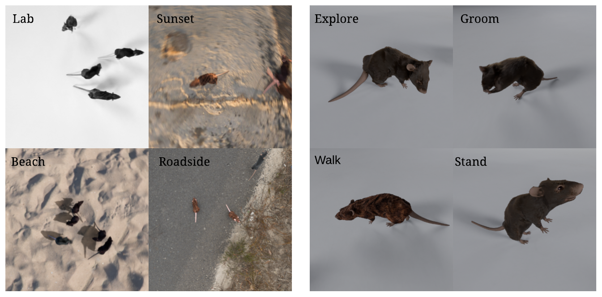

# Animal Pointodyssey

Official implementation of the dataset generation pipeline described in Synthetic Data of Animal Models for Point Tracking (CVPR CV4Animals Workshop 2025). 
[Justin Luo*](https://github.com/justinluo4),
[Rogerio Guimaraes](https://rogeriojr.com/),
[Pietro Perona](https://www.vision.caltech.edu/)
[Neehar Kondapaneni*](https://nkondapa.github.io/),
[Markus Marks*](https://damaggu.github.io/),



## Blender-Mujoco Pipeline

To export the skeleton of a Blender model to Mujoco, use `bones_export.py` in the Blender scripts window. To import the learned motion back into the blender model, use `import_motion.py` in the blender scripts window. For both operations, ensure that you have the armature of your intended model selected (not the mesh)!

Before training a newly-imported model, additional processing must be done to specify the sensors, muscles, and motors present on the animal. Examples for how this can be done are in the `make_dog.py` and `make_mouse.py` scripts. 


## Video Generation

The `gen_videos.py` script generates a set of random scenes based on the default scene generation arguments in `default_args.json`, then renders them automatically. The general scene generation code is in `create_scene.py`, which can either take motion capture data or RL-learned trajectories. The current files are set to generate mouse videos based on motion capture.

Once the arguments and generation script are set, you can begin generation with 

```sh
python gen_videos.py
```
## RL Training

### Stable Baselines 3

`train.py` is the main training script, if using algorithms from Stable Baselines 3. 

Supported environments can be found in `train.py` under `REGISTERED_ENV_NAMES`. 
Custom animal environments can be adapted from the `mouse_env` example. 


Note on environments:
- specific dm-control environments may error with "... shape 0 ..." This is caused because some dm-control environment observations return NumPy arrays of shape `(0,)`, which causes Stable Baselines 3 to bug out. To resolve, I have included the environment wrapper `RemoveZeroShapeObs`, which is used by simply doing `env = RemoveZeroShapeObs(env)`.
- if using both vector and image inputs, lines instantiating the policy type must be changed from "MlpPolicy" to "MultiInputPolicy".
- Otherwise, if error `AttributeError: 'Box' object has no attribute 'spaces'` is returned then "MlpPolicy" must be used instead.
- custom environments can be supplied under the `envs` folder. Include your environment code similar to `envs/dog_env.py` or `envs/mouse_env.py` (which can be refactored), and then edit accordingly in `envs/__init__.py`.
- To get the trajectories to import to Blender, use `--record-traj`.
Command-line arguments should be somewhat straightforward, as described under `parse_args`.

Here is an example run:

```sh
python train.py --env mouse-stand --log-directory ttemplogs --num-timesteps 10000000 --lr 0.001 --eval-freq 50000
````